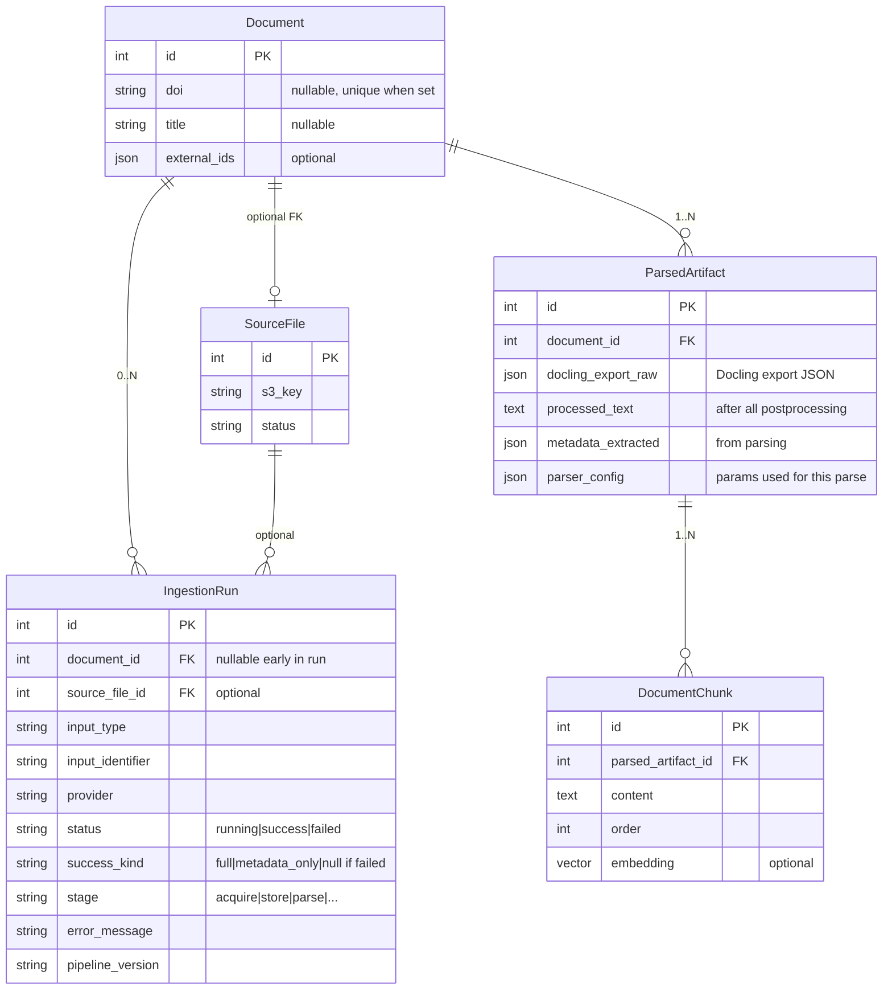
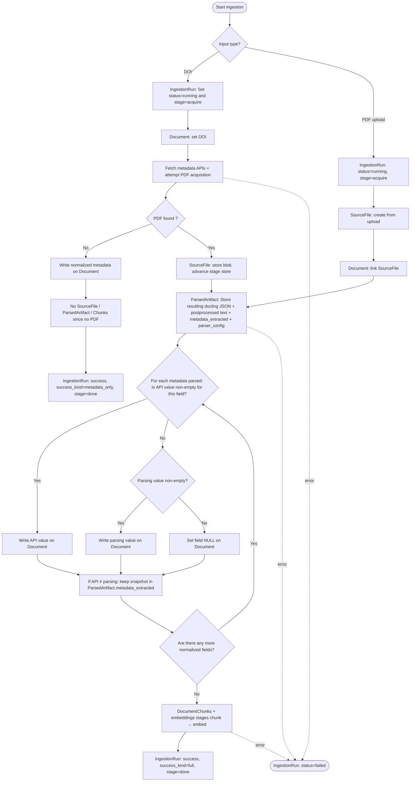
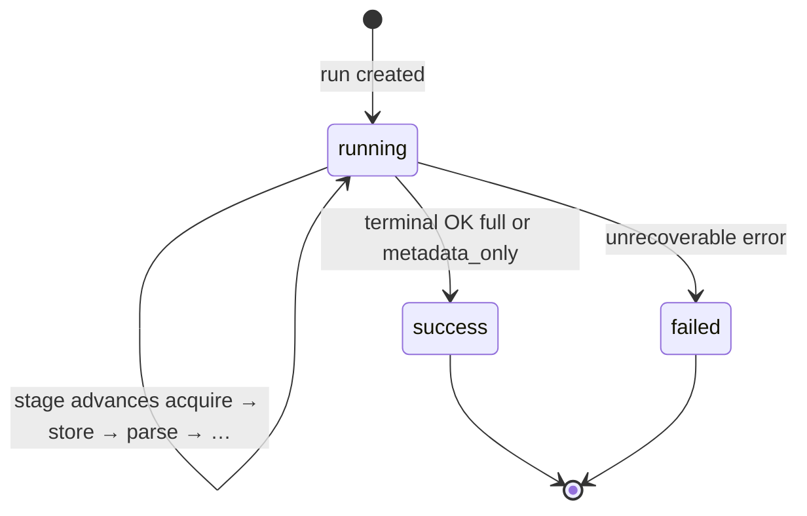

# PRD: Canonical document model (DB schema + migrations)

## Problem Statement

EU Fact Force needs a stable canonical representation of a document in the database so ingestion, parsing, embeddings, search, and future features (claims, graph, trends) can share one notion of “a document.” Today ingestion centers on `SourceFile` (storage + status) and `DocumentChunk` tied only to files. That does not separate logical document identity (DOI or not, national reports, uploads) from physical file artifacts, and it does not capture where metadata came from or ingestion lineage for debugging and audit.

Without this layer, later work (DOI fetch, upload paths, parsing, chunking) risks inconsistent data and expensive refactors.

## Solution

Introduce a canonical `Document` model as the aggregate root for bibliographic and product-facing metadata, with relational polymorphism for future source types (not Django model inheritance). Keep `SourceFile` as the model for stored binary assets (e.g. PDF). Add `IngestionRun` to record each ingestion attempt (lineage). Add `ParsedArtifact` for parse outputs (raw Docling export and postprocessed text), with support for multiple rows per document when history matters; the “current” parse is the latest by `created_at` unless a dedicated flag is added later. Persist raw provider payloads separately from normalized fields so mappings can evolve without losing source truth.

Deliver this as database models and migrations (plus minimal admin registration for visibility). Do not fully rewire the ingestion pipeline in this change; that is follow-up work.

## Deviations from the initial PRD draft (agreed direction)

The following updates supersede earlier bullets in this document where they conflict:

| Topic | Initial draft | Revised decision |
|--------|----------------|------------------|
| `Document.title` | Required non-null/non-blank at DB | Nullable; title may arrive only after API or parsing |
| `ParsedArtifact` cardinality | Strict 1:1 with `Document` | 1:N with `Document`; “current” = latest `created_at` (history preserved if needed) |
| `DocumentChunk` anchoring | Required FK to `Document` | Required FK to `ParsedArtifact` (and thus to `Document` through it) |
| `IngestionRun` outcome | Single notion of success | Two success outcomes: full pipeline vs metadata-only (no file / no parse) |
| Failed runs before parse | N/A | Parser config may live only on `ParsedArtifact`; runs that fail before that row exists are not reproducible from DB alone (accepted tradeoff; compensate with app logs) |

## User Stories

1. As a backend developer, I want a `Document` table where `title` can be null until metadata or parsing supplies it, so that DOI-only or PDF-first flows do not block persistence.
2. As a backend developer, I want `Document` to support optional DOI and other external identifiers, so that national reports and uploads without DOIs are first-class.
3. As a backend developer, I want to create a `Document` with metadata only before any PDF is available, so that workflows can record bibliographic data as soon as it is known.
4. As a backend developer, I want `SourceFile` to represent only the stored file (e.g. S3 key, status), so that file lifecycle stays separate from canonical metadata.
5. As a backend developer, I want `Document` to link to at most one `SourceFile` when a file exists, so that the “metadata-only” and “file attached” states are explicit.
6. As a backend developer, I want deleting a `SourceFile` to delete the related `Document` when that document is tied to that file, so that storage cleanup matches the agreed cascade semantics (see implementation decisions for nullable vs attached cases).
7. As a backend developer, I want an `IngestionRun` row per attempt, so that I can see input type, provider, status, errors, pipeline version, and current stage for support and debugging.
8. As a backend developer, I want raw provider JSON stored on an appropriate model, so that I can reprocess or audit without re-fetching from external APIs.
9. As a backend developer, I want multiple `ParsedArtifact` rows per `Document` when re-parsing occurs, with a clear rule for which row is current (e.g. latest `created_at`), so that optional history does not block schema evolution.
10. As a backend developer, I want `DocumentChunk` to require a `ParsedArtifact`, so that chunks always imply a parse and provenance stays tied to the parse that produced them.

## Relationship to draft research catalog model

A separate draft shared on Mattermost (shown above) sketches entities such as `ResearchPaper`, `Author`, reference tables for document type and evidence hierarchy, `Theme`, `Keywords`, and chunk-level embedding/citation concepts. That draft is not final and describes a broader research-catalog and taxonomy layer than this work.

The codebase uses `Document` as the canonical entity name instead of `ResearchPaper`. This is a voluntary choice for clarity and consistency with the ingestion roadmap; it does not change the intended role of the table as the logical “paper” or publication record.

Scope: This PRD remains limited to the ingestion spine (canonical document, stored file, lineage, raw provider payload, parse artifacts, chunks). Normalized catalog concerns—including `DocType`, `HierarchyOfEvidence`, `Journal`, `Author`, `Keywords`, and theme assignment—are out of scope here and are expected in follow-up work once stable document and chunk identifiers exist.

Themes: The draft shows a single topic/theme identifier per paper; the product direction is to support many themes per document when applicable (e.g. a many-to-many relationship in a later schema). This PRD does not implement theme tables or links.

## Entity relationship (target)

## Implementation Decisions

- Aggregate root: `Document` is the canonical entity for bibliographic/product metadata; `SourceFile` remains a physical artifact. Technical primary key is a generated `id` (not DOI). `SourceFile` is optional on `Document` (metadata-only and DOI-without-PDF cases).
- Polymorphism: Use relational modeling (typed fields / related tables later), not multi-table Django inheritance for `SourceFile` subclasses.
- Identifiers: DOI is optional (`NULL` allowed). Multiple documents may have `NULL` DOI. When DOI is set, enforce uniqueness via a partial unique constraint (non-null DOI only). Normalize DOI in application code before save (e.g. trim, consistent casing) to reduce cosmetic duplicates.
- Title: Nullable at the database level; may be filled from API first, then refined from parsing, or only from parsing on PDF-first flows.
- Partial ingest: Allow `Document` rows with partial metadata before any `SourceFile` exists. Minimum creatable row may be `id` only; mitigate orphan documents with a scheduled cleanup job until stricter invariants are defined.
- Lineage: `IngestionRun` is created at the start of an attempt (`status=running`). It may reference `Document` and/or `SourceFile` when those rows exist. Fields include: input type, input identifier, provider, status, success kind (when `success`), error message, pipeline version, explicit `stage` for resume semantics, timestamps.
- Run stages (closed list for implementation): `acquire`, `store`, `parse`, `postprocess`, `map_metadata`, `chunk`, `embed`, `done`. Distinguish **status** (`running` / `success` / `failed`) from **stage** (where the run stopped or last advanced).
- Success outcomes: **`success` + `success_kind=full`** when acquisition, storage, parsing, postprocessing, metadata mapping, chunking, and embeddings all complete. **`success` + `success_kind=metadata_only`** when the run completes without a storable PDF (no `SourceFile`), hence no parse/chunks/embeds—e.g. DOI resolved to metadata only.
- Raw provider payload: Store verbatim provider response (e.g. JSON) scoped to the run or acquisition step—not as the only copy of truth for normalized `Document` fields.
- Parsed output: `ParsedArtifact` stores at least (a) raw Docling export as JSON, (b) final text after all postprocessing, (c) structured `metadata_extracted` from parsing for merge/audit, (d) parser configuration used for that attempt. New parse attempts append a row; consumers treat the latest `created_at` as current unless a later PRD adds `is_current`.
- Chunks: `DocumentChunk` has a required FK to `ParsedArtifact` (`on_delete=CASCADE`). `ParsedArtifact` has required FK to `Document` (`on_delete=CASCADE`). Retrieval “by document” uses joins through `ParsedArtifact`.
- Retry / idempotency: On retry after failure, delete existing `DocumentChunk` rows for the parse being replaced before recreating chunks (no-op if chunking never ran). Logical correlation key `(input_type, input_identifier, pipeline_version)` may collide on concurrent retries—mitigate in application layer or add a per-attempt correlation id in a follow-up if needed.
- Cascade deletion: Deleting `SourceFile` deletes the attached `Document` when the document is file-dependent (per agreed rules). Deleting `Document` cascades to `ParsedArtifact` and, through it, to `DocumentChunk`. Metadata-only documents have no `SourceFile`; deletion is triggered by removing `Document` directly.
- Metadata merge (normalized fields on `Document`): For `title`, `doi`, `authors`, `publication_date` (and analogous fields), if the API value is non-null and non-empty, it wins when both API and parsing disagree; otherwise use parsing; if both are empty, store `NULL`. Conflicting parsing values can remain in `ParsedArtifact.metadata_extracted` for audit.
- Admin: Light registration for new models; richer admin later.
- Scope boundary: Models and migrations only for this PRD; ingestion services, views, embedding, and chunking do not need to be fully migrated in this deliverable, but migrations should remain applicable to existing deployments.

## Ingestion scenarios (Mermaid)

Single decision tree: input type → DOI branch (PDF yes/no) vs PDF upload → common parse/chunk path when a file exists. The **per-field metadata merge** is the same loop for every normalized field after parse (no separate figure). Dotted edges = error exit to `failed`.

### Unified ingestion decision tree (all paths + merge loop)

### IngestionRun lifecycle (status vs stage)

## Testing Decisions

- Good tests assert observable database behavior: partial unique constraint on DOI when present, cascade behaviour, FK graph (`DocumentChunk` → `ParsedArtifact` → `Document`), and merge rules at the persistence boundary where implemented, not only helper internals.
- Modules to test: Model-level behaviour via Django’s ORM and migrations (integration-style tests in the existing test suite pattern).
- Existing ingestion tests for models, services, and pipeline runs in the repository’s test layout; new tests should follow the same pytest + `django_db` patterns.

## Out of Scope

- Rewriting `run_pipeline`, fetch stubs, or upload flows to use `Document` end-to-end.
- Changing search, embedding, or chunking algorithms or APIs.
- API contract changes for the web app
- Research catalog tables and links (`Author`, `Keywords`, `Theme`, evidence hierarchy, journal normalization, many-to-many themes)—see Relationship to draft research catalog model.

## Further Notes

- Align naming and relationships with the internal roadmap document that describes `Document`, `IngestionRun`, raw assets, parsed artifacts, and chunks as the ingestion spine; reconcile any remaining naming drift in a short addendum if the roadmap still states strict 1:1 `ParsedArtifact`.
- Parser parameters in code today (for reference when populating `ParsedArtifact.parser_config`) include flags such as `postprocess`, `validate_text_bboxes`, and `result_type` as used by the Docling adapter in the ingestion parsing layer.
